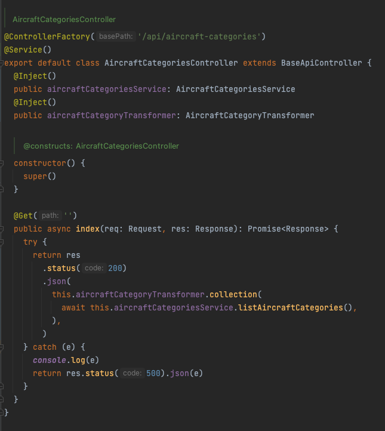

```
 _____ _________________  ___  ______ _____ _   _ 
|_   _|  ___| ___ \ ___ \/ _ \ | ___ \_   _| \ | |
  | | | |__ | |_/ / |_/ / /_\ \| |_/ / | | |  \| |
  | | |  __||    /|    /|  _  ||  __/  | | | . ` |
  | | | |___| |\ \| |\ \| | | || |    _| |_| |\  |
  \_/ \____/\_| \_\_| \_\_| |_/\_|    \___/\_| \_/  
  
                API FRAMEWORK
```


## Terrapin

This project not only provides a foundation for developing high-performance, scalable APIs but also ensures developers can focus more on business logic rather than boilerplate setup. Here's an in-depth exploration of what this framework offers:

-  RESTful APIs with robust routing and middleware support.
-  Microservices for scalable, modular application architectures.
-  Real-time applications through WebSocket integrations.
-  Serverless functions compatible with platforms like AWS Lambda, Azure Functions, or Google Cloud Functions.

## Why Choose This Framework?

-  **TypeScript Support**: Ensures type safety, making your codebase more maintainable and less error-prone.
-  **Dependency Injection**: Facilitates testing and modularity with a built-in IoC container.
-  **Hot Reload:** Enhances development speed by allowing code changes  without server restarts.
-  **Comprehensive Documentation:** Each feature comes with examples and best practices.
-  **Pre-baked Components:**  Utilize Terrapin's built-in components, or roll your own.


## Get Started

Clone this repository:

```
$ git clone https://github.com/skylite-led/terrapin my_api
$ cd my_api
```

Run `$ cp .env.example .env` and populate your environment variables before
starting.

Install `yarn` with `npm i -g yarn`

**Install dependencies with:**
```
$ yarn install
```

**Start the API server with:**
```
$ yarn start
```

**Hot-reload with:**

```
$ yarn start:watch
```

**To run a clean migration, seed and start the API server together run:**
```
$ yarn dev
```

**To create a production build run:**
```
$ yarn build
```


## Framework

### Dependency Injection

Dependency injecton is handled by `typedi.`  Decorators can be used to
specify classes for the IOC Container.

-  Reduces coupling: Classes can be tested in isolation.
-  Promotes modularity: Easier to replace or upgrade components.
-  Simplifies configuration: Use decorators to manage service registration and 
   injection.


Use `@Service()` to mark a class for the IOC Container.

> 

Use `@Inject()` to instantiate the class.

> 

### Controllers

Routing is assembled through `reflect-metadata` and decorated handlers.

`ControllerFactory('prefix')` instantiates a series of handlers at a specified
route prefix

**API Methods:**

`@Get('path')` `@Post('path')` `@Put('path')` `@Delete('path')` `@Patch('path')`

**Example Controller**

> 

#### Create a Controller

> 

To create a new controller, run the command:

```
$ yarn make controller path/to/YourControllerName
```


# Database

Terrapin leverages the powerful engine of [Mikro-ORM](https://mikro-orm.io/) to 
manage migrations in source, and contains customizable scripts to manage your own 
database connections, and where they execute in your deployment scripts.

##  Model Generation Examples

The following examples demonstrate how to use the `yarn make model` command to generate MikroORM models with various options, including primary key types, timestamps, unique constraints, indexing, custom table names, and different types of relationships.

---

### 1. Basic Model with UUID Primary Key and Timestamps

```bash
yarn make model Flight --primaryType string --timestamps
```

- Model: `Flight`
- Primary Key Type: UUID
- Timestamps: Adds `createdAt`, `modifiedAt`, and (optional) `deletedAt` fields for auditing purposes.


This command generates a model `Flight` with a uuid primary key and timestamp fields. The `createdAt` and `modifiedAt` fields are automatically managed by MikroORM.

---

### 2. Model with Unique and Indexed Fields

```bash
yarn make model User --primaryType string --timestamps --unique="email" --index="username"
```

- Model: `User`
- Primary Key Type: UUID
- Unique Field: `email`
- Indexed Field: `username`

This command generates a model `User` with a uuid primary key, `createdAt`,`modifiedAt` timestamps, and applies a unique constraint on the `email` field. The `username` field will be indexed for faster lookup.

---

### 3. Model with Custom Table Name

```bash
yarn make model Order --tableName "orders" --primaryType string --timestamps
```

- Model: `Order`
- Table Name: orders
- Primary Key Type: UUID
- Timestamps: Adds `createdAt`, `modifiedAt`, and (optional) `deletedAt` fields.

This command creates an `Order `model, but instead of using the default class name for the table, it specifies orders as the table name in the database.

---

### 4. Model with One-to-One Relationship

```bash
yarn make model Profile --primaryType string --timestamps --relations="user:User:one-to-one"
```

- Model: `Profile`
- Primary Key Type: UUID
- One-to-One Relationship: Links to `User` via a user field.
- Timestamps: Adds `createdAt`, `modifiedAt`, and (optional) `deletedAt` fields.

This command creates a `Profile` model with a one-to-one relationship to the User model. This relationship implies that each `Profile` is associated with one `User`.

---

### 5. Model with Many-to-One Relationship

```bash
yarn make model Flight --primaryType string --timestamps --relations="airport:Airport:many-to-one"
```

- Model: `Flight`
- Primary Key Type: UUID
- Many-to-One Relationship: Links to `Airport` via an airport field.
- Timestamps: Adds `createdAt`, `modifiedAt`, and (optional) `deletedAt` fields.

This command generates a `Flight` model with a many-to-one relationship to `Airport`, meaning that each flight is associated with a single airport, but an airport can have multiple flights.

---

### 6. Model with One-to-Many Relationship

```bash
yarn make model Airport --primaryType string --timestamps --relations="flights:Flight:one-to-many"
```

- Model: `Airport`
- Primary Key Type: UUID
- One-to-Many Relationship: Links to `Flight` via a flights field. 
- Timestamps: Adds `createdAt`, `modifiedAt`, and (optional) `deletedAt` fields.

This command creates an `Airport` model with a one-to-many relationship to `Flight`, allowing each airport to have multiple associated flights.

---

### 7. Model with Many-to-Many Relationship

```bash
yarn make model Flight --primaryType string --timestamps --relations="passengers:Passenger:many-to-many"
```

- Model: `Flight`
- Primary Key Type: UUID
- Many-to-Many Relationship: Links to Passenger via a passengers field.
- Timestamps: Adds `createdA`, `modifiedAt`, and (optional) `deletedAt` fields.

This command generates a `Flight` model with a many-to-many relationship to `Passenger`, allowing each flight to have multiple passengers and each passenger to take multiple flights.

In a many-to-many relationship, it is assumed that the inverse relationship 
is the owner. (i.e. associating a `Flight` with a `Passenger` grants ownership to the `Passenger`)

### 8. Complex Model with Multiple Relations

```bash
yarn make model Booking --primaryType string --timestamps --relations="user:User:many-to-one, flight:Flight:many-to-one, tickets:Ticket:one-to-many"
```
- Model: `Booking`
- Primary Key Type: UUID
- Many-to-One Relationships: `user` (links to `User`), flight (links to `Flight`)
- One-to-Many Relationship: `tickets` (links to `Ticket`)
- Timestamps: Adds `createdAt`, `modifiedAt`, and (optional) `deletedAt` fields.

This command creates a `Booking` model that:

- Links to `User` and `Flight` with many-to-one relationships.
- Contains a one-to-many relationship with `Ticket for booking tickets.
